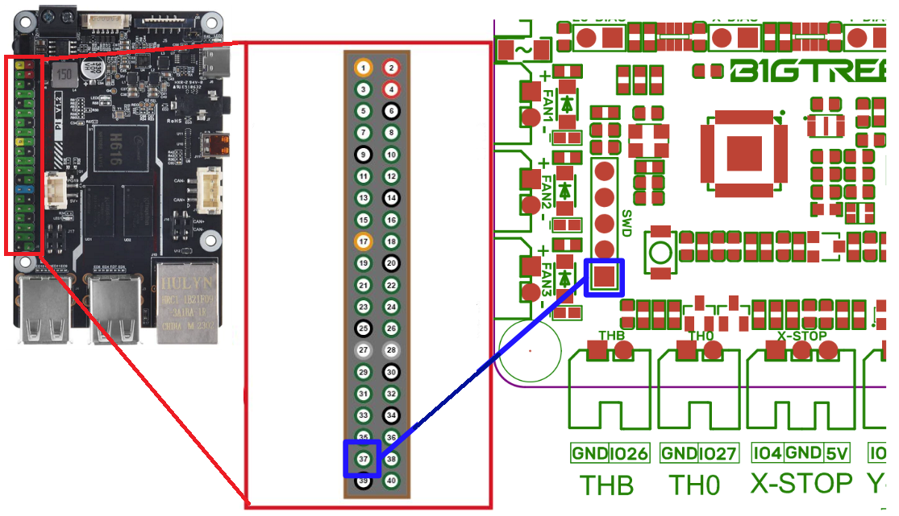

# Work Around: SKR Pico not present after booting or rebooting the Rpi

## Symptom

When booting or rebooting the Raspberry Pi, the SKR Pico is not present on the USB bus. In ssh `dmesg` will report "Unable to enumerate", and `lsusb` will not show the board. Pressing the "RESET" button on the SKR Pico often fixes the issue.

For RasPi users, see https://github.com/tonhe/SKR-Pico-Reset-Fix

## Workaround

Since no real solution exists so far, we can implement a mechanism to reset the SKR Pico without needing to physically press the RESET button.

- **Install GPIOD** 
```
sudo apt install gpiod
```
- **Connect a dupont-style jumper cable from the SKR Pico's Reset pin on the SWD Header to the BTT Pi GPIO 79 (Pin 37).** Refer to the attached picture for details. This allows us to control the RESET mechanism of the SKR Pico remotely.
- **Copy and paste the following commands (right-click in Putty to paste) to create a restart script**:
```
cat << EOT > /usr/local/bin/restart-skr-pico.sh
#!/bin/bash
gpioset -D open-drain gpiochip0 79=0
gpioset -D open-source gpiochip0 79=0
EOT
chmod +x /usr/local/bin/restart-skr-pico.sh
```

- **To manually reset the SKR Pico, execute** `/usr/local/bin/restart-skr-pico.sh`

## Modified Workaround

Some SKR Picos need rebooting multiple times, this script will perform that once per second until it is present. The same dupont connector is needed.

```
#!/bin/bash
port=/dev/serial/by-id/usb-Klipper_rp2040_<<<YOUR_ID_HERE>>>-if00

while ! [ -e "$port" ]
do
   echo "SKR is not found"
   /usr/bin/gpioset -D open-drain gpiochip0 79=0
   /usr/bin/gpioset -D open-source gpiochip0 79=0
   sleep 1
done
echo "SKR is found!"
exit 0
```


- **To automatically reset the SKR Pico prior each Klipper start, copy and paste this command to modify the Klipper service, then restart your Pi:**
```
sudo mkdir /etc/systemd/system/klipper.service.d
echo -e '[Service]\nExecStartPre=/usr/local/bin/restart-skr-pico.sh' | sudo tee /etc/systemd/system/klipper.service.d/restart-rp2040.conf
sudo systemctl daemon-reload
```

# Wiring


